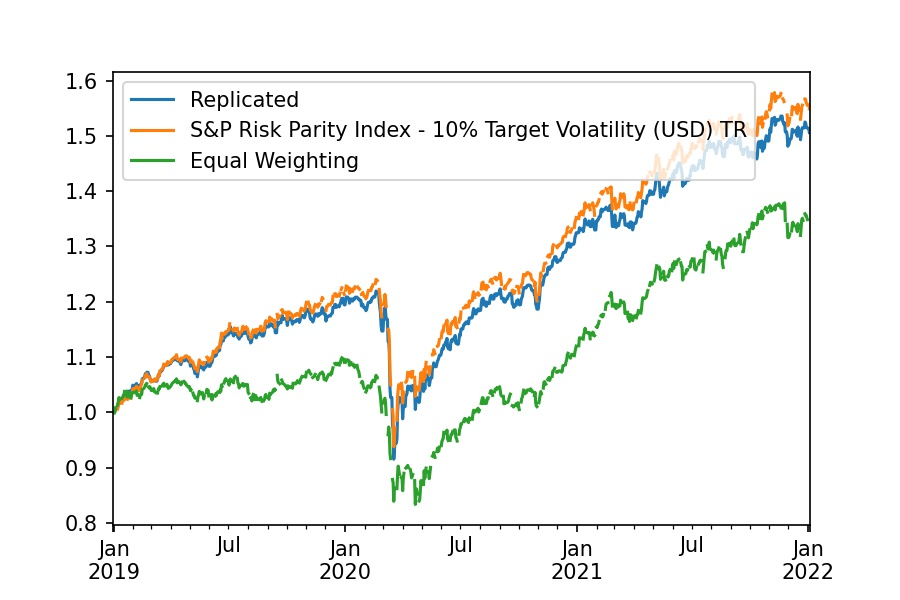
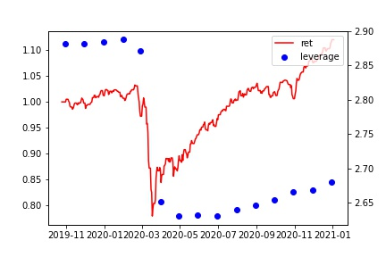
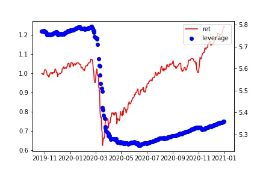
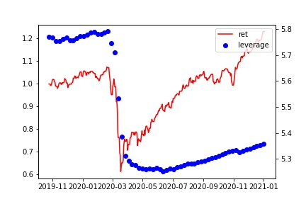

Portfolio replication of S&P Risk Parity.
The replciated curve looks very similar to the actual
S&P Risk Parity Index.

# Comparison Graph


# Correlation table
|                        |   Replicated | S&P Risk Parity Index |   Equal Weighting |
|:-----------------------|-------------:|----------------------:|------------------:|
| Replicated             |         1    |                  0.99 |              0.87 |
| S&P Risk Parity Index  |         0.99 |                     1 |              0.87 |
| Equal Weighting        |         0.87 |                  0.87 |              1    |


# Performance Metrics
### Monthly Rebalancing

```plaintext
Start                                2012-01-04 00:00:00
End                                  2022-01-03 00:00:00
Duration                              3652 days 00:00:00
Return (Ann.) [%]                               6.060919
Volatility (Ann.) [%]                           6.524049
Information Ratio                               0.929012
Final AUM [unitless]                            1.844498
AUM Peak [$]                                    1.851624
Final Return [%]                               84.449819
Max. Drawdown [%]                             -10.847945
Max. Drawdown Duration                 427 days 00:00:00
Avg. Drawdown Duration       117 days 20:52:10.434782608
Max. Underwater Duration               463 days 00:00:00
Total Underwater Duration             2588 days 00:00:00
```


### Daily Rebalancing
```plaintext
Start                                2011-12-26 00:00:00
End                                  2022-01-03 00:00:00
Duration                              3661 days 00:00:00
Return (Ann.) [%]                              12.314176
Volatility (Ann.) [%]                          12.948966
Information Ratio                               0.950978
Final AUM [unitless]                            3.358408
AUM Peak [$]                                    3.384495
Final Return [%]                               229.64858
Max. Drawdown [%]                             -21.079729
Max. Drawdown Duration                 427 days 00:00:00
Avg. Drawdown Duration       117 days 20:52:10.434782608
Max. Underwater Duration               463 days 00:00:00
Total Underwater Duration             2595 days 00:00:00
dtype: object
```

### Weekly Rebalancing


#### Monday
```plaintext
Start                                2012-01-05 00:00:00
End                                  2022-01-03 00:00:00
Duration                              3651 days 00:00:00
Return (Ann.) [%]                              11.997857
Volatility (Ann.) [%]                          12.997589
Information Ratio                               0.923083
Final AUM [unitless]                            3.249234
AUM Peak [$]                                    3.274488
Final Return [%]                              224.923424
Max. Drawdown [%]                             -21.263554
Max. Drawdown Duration                 427 days 00:00:00
Avg. Drawdown Duration       119 days 05:13:02.608695652
Max. Underwater Duration               463 days 00:00:00
Total Underwater Duration             2587 days 00:00:00
```

#### Tuesday
```plaintext
Start                                2012-01-06 00:00:00
End                                  2022-01-03 00:00:00
Duration                              3650 days 00:00:00
Return (Ann.) [%]                              12.089039
Volatility (Ann.) [%]                          12.998547
Information Ratio                                0.93003
Final AUM [unitless]                            3.275356
AUM Peak [$]                                    3.300813
Final Return [%]                              227.535572
Max. Drawdown [%]                             -21.293828
Max. Drawdown Duration                 427 days 00:00:00
Avg. Drawdown Duration       119 days 05:13:02.608695652
Max. Underwater Duration               463 days 00:00:00
Total Underwater Duration             2587 days 00:00:00
```

#### Wednesday
```plaintext
Start                                2012-01-04 00:00:00
End                                  2022-01-03 00:00:00
Duration                              3652 days 00:00:00
Return (Ann.) [%]                               11.96807
Volatility (Ann.) [%]                          12.975872
Information Ratio                               0.922333
Final AUM [unitless]                            3.241723
AUM Peak [$]                                    3.266918
Final Return [%]                              224.172348
Max. Drawdown [%]                             -21.201617
Max. Drawdown Duration                 427 days 00:00:00
Avg. Drawdown Duration       119 days 05:13:02.608695652
Max. Underwater Duration               463 days 00:00:00
Total Underwater Duration             2588 days 00:00:00
```

#### Thursday
```plaintext
Start                                2012-01-05 00:00:00
End                                  2022-01-03 00:00:00
Duration                              3651 days 00:00:00
Return (Ann.) [%]                              12.008676
Volatility (Ann.) [%]                          12.975407
Information Ratio                               0.925495
Final AUM [unitless]                              3.2525
AUM Peak [$]                                    3.277782
Final Return [%]                              225.249986
Max. Drawdown [%]                             -21.175461
Max. Drawdown Duration                 427 days 00:00:00
Avg. Drawdown Duration       117 days 20:52:10.434782608
Max. Underwater Duration               463 days 00:00:00
Total Underwater Duration             2587 days 00:00:00
```

#### Friday
```plaintext
Start                                2011-12-30 00:00:00
End                                  2022-01-03 00:00:00
Duration                              3657 days 00:00:00
Return (Ann.) [%]                              12.176431
Volatility (Ann.) [%]                          12.986651
Information Ratio                               0.937611
Final AUM [unitless]                            3.309598
AUM Peak [$]                                    3.335326
Final Return [%]                              228.613869
Max. Drawdown [%]                             -21.238982
Max. Drawdown Duration                 427 days 00:00:00
Avg. Drawdown Duration       117 days 20:52:10.434782608
Max. Underwater Duration               463 days 00:00:00
Total Underwater Duration             2594 days 00:00:00
```